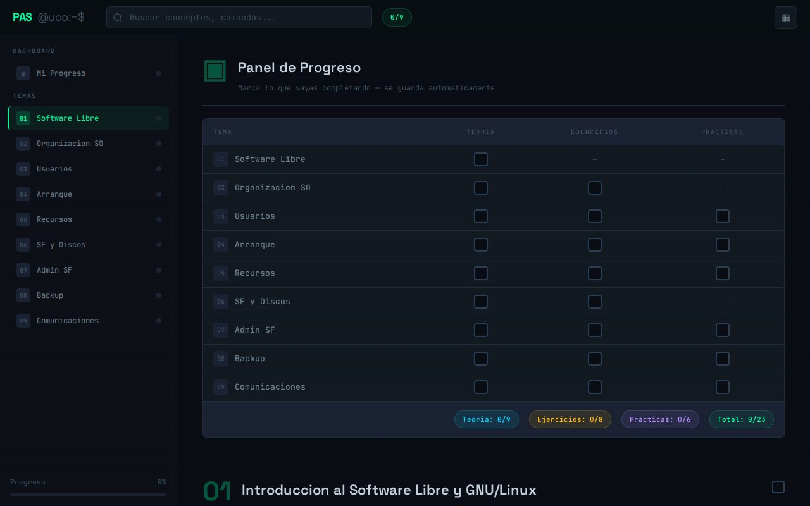

# PAS 2025-2026

Terminal de aprendizaje interactivo para la asignatura PAS.

🔗 **[dario-acosta-sanchez.github.io/PAS](https://dario-acosta-sanchez.github.io/PAS/)**

## Qué incluye

- Temario organizado por bloques
- Panel de progreso para marcar lo estudiado

## Tecnologías

 

---

Hecho por [Darío Acosta](https://github.com/Dario-Acosta-Sanchez).
